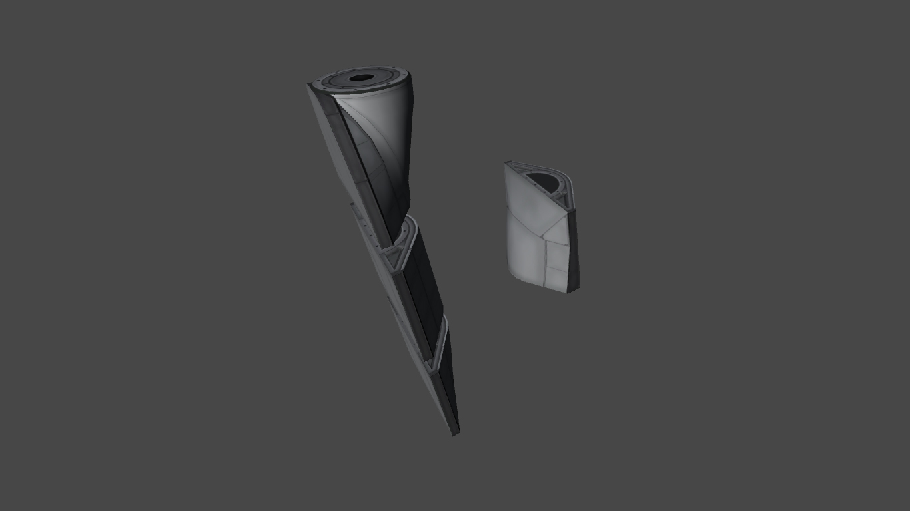

# Airplane+ /L Unofficial

Powerful stockalike parts for aircraft enthusiasts.

Unofficial fork by Lisias.

## In a Hurry

* [Latest Release](https://github.com/net-lisias-kspu/AirplanePlus/releases)
	+ [Binaries](https://github.com/net-lisias-kspu/AirplanePlus/tree/Archive)
* [Source](https://github.com/net-lisias-kspu/AirplanePlus)
* Documentation
	+ [Project's README](https://github.com/net-lisias-kspu/AirplanePlus/blob/master/README.md)
	+ [Install Instructions](https://github.com/net-lisias-kspu/AirplanePlus/blob/master/INSTALL.md)
	+ [Change Log](./CHANGE_LOG.md)
	+ [Known Issues](./KNOWN_ISSUES.md) list

## Description

Aircraft Collection Album: https://imgur.com/a/ySFgL

The latest information, craft files, pictures and Manual Patches from Users are also in the forums (Tweakscale and RPM for certain parts).

Adds a collection plane parts which came from different timelines.. All of which are in the image album. Feel free to take a look. If you think that there are too many parts, consult the part deleter's guide in the zip.

Most engine performance configurations made possible with the help of Tanner Rawlings.

### Images

#### Halved Mk2 Parts

#### Mk1 Sliding Door Cargo Bay

#### Cockpits

See [imgur album](http://imgur.com/a/q3FAx)

#### Landing Gears Demo Video

<iframe width="560" height="315" src="https://www.youtube.com/embed/WVW5x16ZSCA" title="YouTube video player" frameborder="0" allow="accelerometer; autoplay; clipboard-write; encrypted-media; gyroscope; picture-in-picture" allowfullscreen></iframe>

## Installation

Detailed installation instructions are now on its own file (see the [In a Hurry](#in-a-hurry) section) and on the distribution file.

## License:

This AddOn licensed under [CC BY-NC-SA 4.0](https://creativecommons.org/licenses/by-nc-sa/4.0/?), what allows you to:

* copy and redistribute the material in any medium or format
* create derivatives
 
But explicitly forbids you to:

* Exploit it commercially

Please note the copyrights and trademarks in [NOTICE](./NOTICE).

## UPSTREAM

* [blackheart612](https://forum.kerbalspaceprogram.com/index.php?/profile/42741-blackheart612/)
	+ [KSP Forum](https://forum.kerbalspaceprogram.com/index.php?/topic/140262-14x-144-airplane-plus-r230-full-1875m-parts-crj-series-new-jet-engine-fixes-jul-20-2018/)
	+ Imgur
		- [AirplanePlus](https://imgur.com/a/6kDLM)
		- [Cockpits R8.0](https://imgur.com/a/q3FAx) 
	+ [Spacedock](https://spacedock.info/mod/716/Airplane%20Plus)
	+ [CurseForge](https://www.curseforge.com/kerbal/ksp-mods/airplane-plus)
	+ [GitHub](https://github.com/blackheart612/AirplanePlus)
